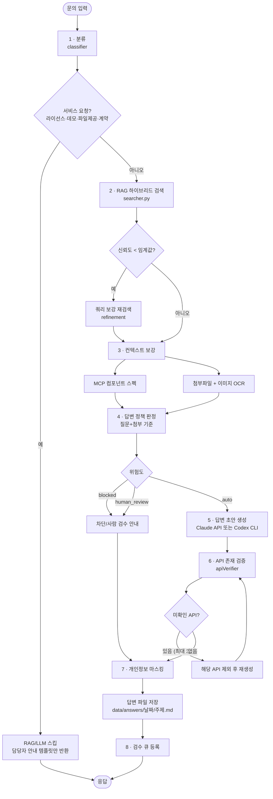
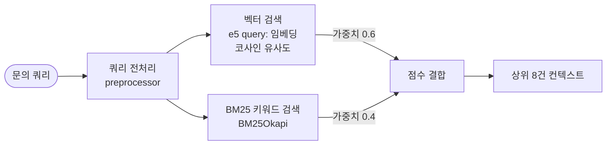
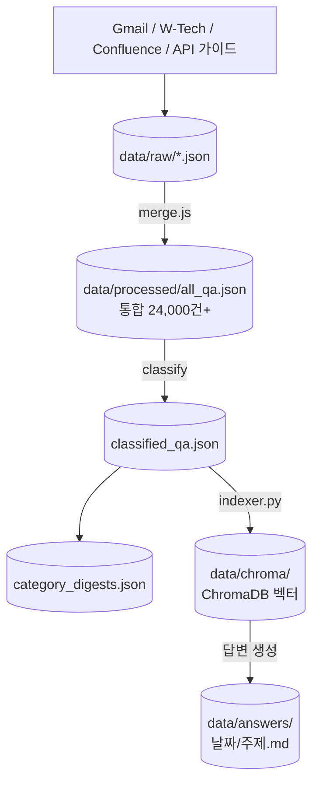
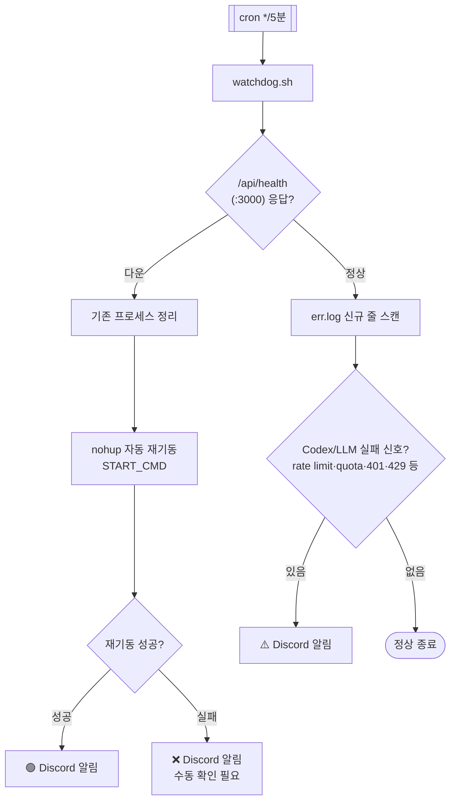

# TechAssistant — AI 기술문의 자동 답변 시스템

인스웨이브 **WebSquare 기술지원팀**이 고객 기술문의에 대해 **유사 사례 검색(RAG) + 답변 초안 자동 생성**을 수행하는 시스템입니다. 9개 데이터 소스에서 수집한 24,000건+ 통합 Q&A를 분류·인덱싱하여, 문의가 들어오면 하이브리드 검색으로 근거를 찾고 LLM으로 답변 초안을 만든 뒤 **API 존재 검증 → 검수 큐** 까지 자동으로 처리합니다.

> 처음 설치하시는 분은 [설치 및 설정 가이드](docs/setup-guide.md)를, Claude Code 작업 지침은 [CLAUDE.md](CLAUDE.md)를 참고하세요.

---

## 주요 기능

- **9개 데이터 소스 자동 수집** — Gmail 기술문의, W-Tech QNA/FAQ, Confluence 5개 스페이스, API 가이드 등
- **하이브리드 RAG 검색** — 벡터(코사인) + BM25 키워드 검색 결합, 저신뢰 시 자동 쿼리 보강
- **LLM 답변 초안 생성** — Anthropic Claude API **또는** Codex CLI 중 선택 (`llmProvider`)
- **API 존재 검증 루프** — 답변에 등장한 API/이벤트/속성을 로컬 가이드·RAG DB에서 검증, 미확인 시 최대 3회 재생성
- **답변 위험도 정책** — 질문·첨부 기준으로 `auto` / `human_review` / `blocked` 판정
- **첨부파일 처리** — 이미지 OCR(Tesseract), 첨부 컨텍스트 추출
- **WebSquare MCP 연동** — 컴포넌트 스펙/가이드를 답변 컨텍스트로 주입
- **개인정보 자동 마스킹** — 이름·이메일·회사명·프로젝트명 제거
- **REST API 서버** — 검색·답변·검수 큐·첨부 다운로드 엔드포인트
- **운영 모니터링** — 워치독(health 감시 + 자동 재기동 + Discord 알림)

---

## 아키텍처 개요

5개 핵심 모듈이 순차 파이프라인으로 연결됩니다.

```mermaid
flowchart LR
    subgraph collect["1. 데이터 수집<br/>src/collectors"]
        G[Gmail IMAP]
        W[W-Tech QNA/FAQ]
        C[Confluence]
        A[API 가이드]
    end
    collect --> raw[("data/raw/*.json")]
    raw --> merge["2. 데이터 통합<br/>scripts/merge.js"]
    merge --> allqa[("data/processed/<br/>all_qa.json")]
    allqa --> classify["3. 자동 분류<br/>src/classifier"]
    classify --> classified[("classified_qa.json")]
    classified --> index["4. RAG 인덱싱<br/>src/rag (Python)"]
    index --> chroma[("data/chroma/<br/>ChromaDB")]
    chroma --> gen["5. 답변 생성<br/>src/generator"]
    gen --> ans[("data/answers/<br/>날짜/주제.md")]
```



| 단계 | 모듈 | 역할 |
|------|------|------|
| ① 수집 | `src/collectors/` | 9개 소스 크롤링 → `data/raw/` |
| ② 통합 | `scripts/merge.js` | 통합 포맷 변환 + 중복 제거 → `all_qa.json` |
| ③ 분류 | `src/classifier/` | 정규식 룰 엔진으로 13개 대분류 + 다이제스트 |
| ④ 인덱싱 | `src/rag/` (Python) | 임베딩 + ChromaDB 벡터 인덱싱 |
| ⑤ 생성 | `src/generator/` | 분류→검색→생성→검증 오케스트레이션 |

---

## 데이터 소스

| 소스 | 수집 모듈 | 방식 |
|------|-----------|------|
| Gmail 기술문의 | `gmailCollector.js` | IMAP 2-Phase (UID 경량 검색 → 배치 다운로드), X-GM-RAW 병렬 쿼리 |
| W-Tech QNA | `wtechCollector.js` | Puppeteer 크롤링 |
| W-Tech FAQ | `wtechFaqCollector.js` | Puppeteer 크롤링 |
| Confluence | `confluenceCollector.js` | 5개 스페이스 (Inside, UXDB, 기술지식DB, PA, W5C) |
| API 가이드 | `apiGuideCollector.js` | HTML → JSON 변환 |

> 기존 크롤링 스크립트 26종은 `src/collectors/legacy/`에 참고용으로 보관되어 있습니다.

---

## 답변 생성 파이프라인 (핵심 로직)

`src/generator/pipeline.js`의 `process()`가 전체를 오케스트레이션합니다. 문의 → 답변 초안까지의 실제 분기 로직은 다음과 같습니다.



**단계별 설명**

1. **분류** — 13개 대분류로 카테고리 판정
2. **서비스 요청 차단(short-circuit)** — 라이선스/데모/엔진·플러그인 파일 제공/계약·권한 등은 기술 답변 대상이 아니므로 RAG·LLM을 거치지 않고 담당자 안내 템플릿만 반환
3. **RAG 하이브리드 검색** — 유사 사례 검색. 신뢰도가 임계값 미만이면 쿼리를 보강(`refinement`)해 재검색
4. **컨텍스트 보강** — WebSquare MCP 컴포넌트 스펙 + 첨부파일/이미지 OCR 결과를 컨텍스트에 주입
5. **답변 정책 판정** — **질문·첨부만** 기준으로 위험도 산정(RAG 이웃 사례의 키워드가 오격상시키지 않도록 cases는 제외). `blocked`/`human_review`/`auto`
6. **답변 초안 생성** — `llmProvider` 설정에 따라 Claude API 또는 Codex CLI 호출
7. **API 존재 검증** — 답변에 등장한 모든 API/이벤트/속성명을 로컬 가이드·RAG DB에서 `$contains` 검색으로 확인. 미확인 항목이 있으면 해당 API를 제외하고 **최대 3회** 재생성
8. **저장 + 검수 큐** — `data/answers/날짜/주제.md`로 저장 후 검수 큐(`/api/queue`)에 등록

> 추가 질문(후속 문의)은 `processFollowUp()`이 동일한 검색→정책→생성→검증 흐름으로 처리합니다.

---

## RAG 하이브리드 검색

`src/rag/searcher.py`는 **벡터 검색**과 **BM25 키워드 검색**을 가중 결합합니다.



| 항목 | 값 |
|------|-----|
| 임베딩 모델 | `intfloat/multilingual-e5-base` (768차원) |
| 벡터 DB | ChromaDB, 컬렉션 `techassistant_qa` |
| e5 프리픽스 | 문서 `passage:` / 쿼리 `query:` |
| 인덱싱 배치 | 256건 배치 + 실패 시 개별 재시도 |
| 결합 가중치 | 벡터 0.6 : BM25 0.4 |
| 반환 건수 | 상위 8건 (`TOP_K`) |

---

## REST API 서버

`src/api/server.js` (Express). 기본 포트 **3000**, 답변 생성은 API Key 인증이 필요합니다.

| 메서드 · 경로 | 인증 | 설명 |
|---|---|---|
| `GET /api/health` | 불필요 | 헬스 체크 (`{status, timestamp, version}`) |
| `POST /api/search` | 불필요 | RAG 하이브리드 검색 |
| `POST /api/answer` | **API Key** | 답변 초안 생성 (전체 파이프라인) |
| `* /api/queue` | — | 검수 큐 조회/처리 |
| `* /api/attachment` | 라우터 내부 | 첨부파일 다운로드 |

```bash
# 서버 기동
npm run server     # = node src/api/server.js

# 헬스 체크
curl http://localhost:3000/api/health
```

---

## LLM 프로바이더

`config.json`의 `llmProvider`로 답변 생성 백엔드를 선택합니다.

| 프로바이더 | 설정 키 | 비고 |
|---|---|---|
| Anthropic Claude API | (API Key) | `node scripts/answer.js` 등 직접 호출 시 |
| Codex CLI | `codexExec` (command/args/model/timeoutMs) | 운영 서버 기본. `codex exec` 호출 |

> 운영 서버는 Codex CLI를 사용하므로, 워치독이 `server.err.log`에서 `codex exec` 실패·rate limit·quota 등의 신호를 감시합니다.

---

## 기술 스택

- **수집/분류/생성/서버**: Node.js (>=18), Express, Puppeteer, IMAP
- **RAG 벡터 검색**: Python **3.10**, ChromaDB, sentence-transformers (`multilingual-e5-base`), rank-bm25, torch
- **LLM**: Anthropic Claude API / Codex CLI
- **OCR**: Tesseract (`config.ocr`)

---

## 설치

```bash
# 1) Node.js 의존성
npm install

# 2) Python 의존성 (conda 환경 권장: .conda-envs/rag, Python 3.10)
pip install -r requirements.txt

# 3) 설정 파일 생성
cp config/config.example.json config/config.json
#  → Gmail App Password, Anthropic API Key 또는 Codex 설정, W-Tech/Confluence 인증 등 입력
```

Python 경로는 `PYTHON_PATH` 환경변수로 지정할 수 있으며, 미지정 시 `./.conda-envs/rag/bin/python3.10`을 사용합니다.

---

## 설정 (`config/config.json`)

`config.example.json`을 복사해 작성합니다. 주요 섹션:

| 섹션 | 설명 |
|------|------|
| `gmail` | IMAP 계정 (OAuth 또는 App Password), 검색 쿼리 |
| `wtech` / `wtechFaq` | W-Tech 로그인 정보 + 크롤링 셀렉터 |
| `confluence` | Base URL + API 토큰 |
| `apiGuide` | API 가이드 소스 디렉터리 |
| `apiVerifier` | API 검증 대상 로컬 문서 경로/확장자 |
| `ocr` | Tesseract 명령·언어·타임아웃·이미지 한도 |
| `llmProvider` / `codexExec` | LLM 백엔드 선택 + Codex CLI 실행 설정 |
| `mcp` | WebSquare MCP 연동 (provider/endpoint/캐시) |
| `answer` | 담당자명, 답변 템플릿, 프롬프트 메모리 |
| `refinement` | 저신뢰 쿼리 보강 (임계값/최대 재검색 수) |
| `api` | 서버 포트, API Key |

답변 템플릿 예시:

```json
{
  "answer": {
    "responderName": "담당자명",
    "template": "안녕하세요.\n인스웨이브 기술지원팀 {{name}} 프로입니다.\n\n{{topic}}과 관련하여 확인 후 답변드립니다.\n\n{{content}}\n\n감사합니다."
  }
}
```

---

## 사용법

```bash
# 데이터 수집 (전체 / 개별)
npm run collect
npm run collect:gmail
npm run collect:wtech
npm run collect:confluence

# 데이터 통합 (data/raw → data/processed/all_qa.json)
node scripts/merge.js

# 자동 분류
npm run classify

# RAG 인덱싱 (증분 / 전체 재인덱싱)
npm run index
npm run index:reset

# RAG 검색 테스트
npm run search "gridView 셀 병합 방법"

# 답변 생성 (CLI)
node scripts/answer.js "기술문의 내용" --version v5.0

# 전체 파이프라인 (수집 → 분류 → 인덱싱)
npm run pipeline

# API 서버 기동
npm run server
```

테스트 스크립트(`npm run test:*`): 답변 정책, 프롬프트 메모리, API 검증, 첨부 컨텍스트, 샘플 파일 정책, 마스킹, OCR 등.

---

## 데이터 흐름



---

## 운영 모니터링 — 워치독

운영 서버에 **health 감시 + 자동 재기동 + Discord 알림**을 붙이는 스크립트입니다. (`scripts/watchdog.sh`, cron 5분 주기 권장)



| 항목 | 내용 |
|------|------|
| 설정 | `scripts/watchdog.conf` (웹훅 등 시크릿, **커밋 금지** — `watchdog.conf.example` 참고) |
| health | `GET /api/health` 실패 시 자동 재기동 후 결과 알림 |
| 재기동 | `START_CMD` 우선, 없으면 기본 nohup (반드시 백그라운드 기동) |
| 에러 감시 | `server.err.log` 신규 줄에서 `codex exec`·rate limit·quota·401/429 등 스캔 |
| 첫 실행 | 과거 로그 전체 알림 방지를 위해 오프셋만 기록하고 스킵 |

```bash
# 설정
cp scripts/watchdog.conf.example scripts/watchdog.conf   # WEBHOOK="..." 입력

# cron 등록 (5분 주기)
*/5 * * * * /경로/scripts/watchdog.sh >> /경로/logs/watchdog.log 2>&1
```

---

## 프로젝트 구조

```
├── config/                      # 설정 (config.example.json → config.json)
├── data/
│   ├── raw/                     # 소스별 원본 데이터
│   ├── processed/               # 통합/분류 데이터, 다이제스트
│   ├── chroma/                  # ChromaDB 벡터 DB
│   └── answers/                 # 생성된 답변 파일
├── scripts/                     # CLI 스크립트
│   ├── answer.js                # 답변 생성
│   ├── classify.js              # 자동 분류
│   ├── collect.js               # 데이터 수집
│   ├── merge.js                 # 데이터 통합
│   ├── watchdog.sh              # 운영 워치독
│   └── test_*.js                # 정책/검증 테스트
├── src/
│   ├── api/                     # Express REST 서버
│   │   ├── server.js            # 엔트리포인트
│   │   ├── middleware/auth.js   # API Key 인증
│   │   ├── routes/              # answer · search · queue · attachment · scan
│   │   └── queue.js             # 검수 큐
│   ├── classifier/              # 분류 엔진 (categories, classifier, digest)
│   ├── collectors/              # 데이터 수집 (+ legacy/ 26종)
│   ├── generator/               # 답변 생성 파이프라인
│   │   ├── pipeline.js          # 전체 오케스트레이션
│   │   ├── answerGenerator.js   # LLM 답변 생성
│   │   ├── answerPolicy.js      # 위험도/답변모드 판정
│   │   ├── apiVerifier.js       # API 존재 검증
│   │   ├── queryRefinement.js   # 저신뢰 쿼리 보강
│   │   ├── attachmentContext.js # 첨부 컨텍스트
│   │   ├── ocr.js               # 이미지 OCR
│   │   ├── mcpContext.js        # WebSquare MCP 연동
│   │   └── promptMemory.js      # 프롬프트 메모리
│   ├── parsers/                 # API 가이드/샘플 파서
│   ├── rag/                     # RAG 검색 (Python)
│   │   ├── preprocessor.py      # 텍스트/쿼리 전처리
│   │   ├── indexer.py           # 벡터 인덱싱
│   │   └── searcher.py          # 하이브리드 검색
│   └── utils/                   # config, masking, converter, pythonPath
├── CLAUDE.md                    # Claude Code 작업 지침 (답변 생성 규칙 상세)
└── README.md
```

---

## 답변 생성 규칙 (요약)

상세 규칙은 [CLAUDE.md](CLAUDE.md)에 정의되어 있습니다. 핵심만 추리면:

- **RAG 결과가 있을 때** — 참고자료 기반으로만 답변(추측 금지), 출처 표기 필수
- **RAG 결과가 없을 때** — WebSquare 공식 문서/일반 지식 기반 답변 가능하나 **면책 문구** 필수, 임의 출처 생성 금지
- **코드 예시** — 참고자료의 검증된 코드 우선, 새로 작성 시 "참고용·동작 확인 필요" 명시
- **버전 검증** — 엔진 파일명 네이밍 규칙(`poi4`=POI 4.x 등)에 따라 실제 릴리즈 버전인지 확인
- **개인정보** — 이름·이메일·회사명·프로젝트명 절대 포함 금지 (`src/utils/masking.js`)
```
# ai-answer-codex
