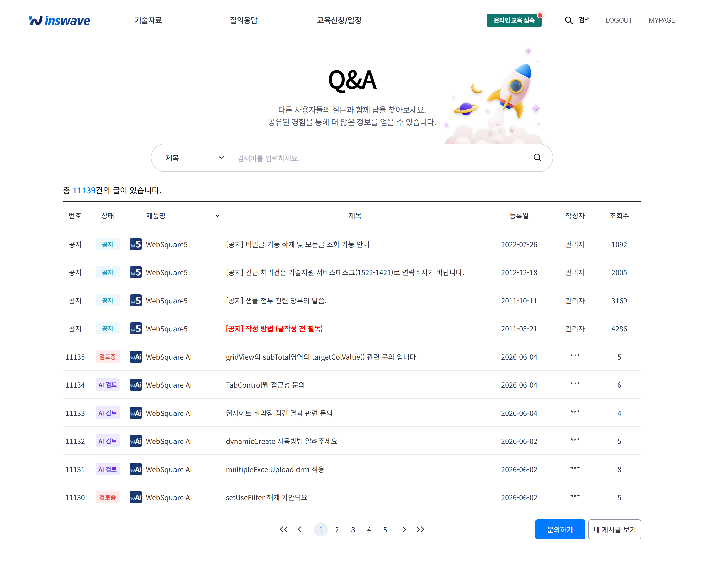
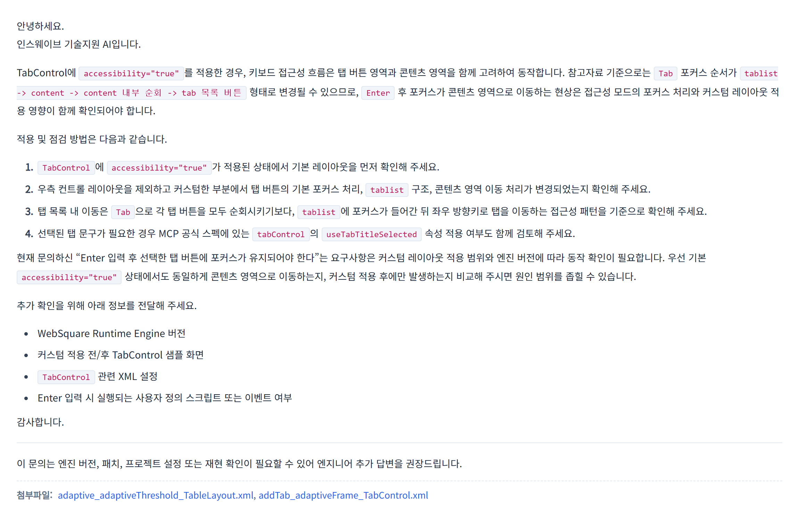
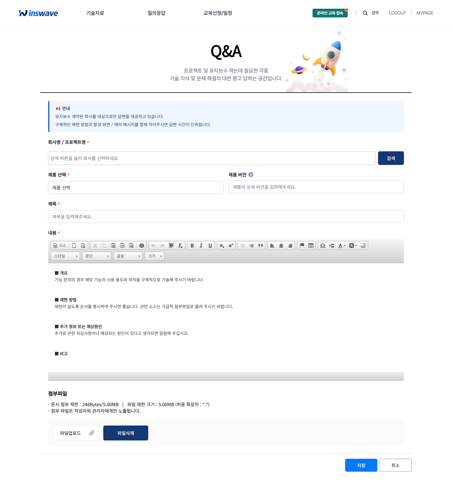

# 기술지원 게시판 리뉴얼 안내 — AI 자동 답변 서비스 오픈

> 적용일: **2026년 6월** · 대상: **유지보수 계약 업체**

안녕하세요. 인스웨이브 기술지원팀입니다.

평소 WebSquare 기술지원 게시판을 이용해 주시는 고객 여러분께 감사드립니다.
고객님의 기술문의에 **더 빠르고, 더 근거 있는** 답변을 드리기 위해 기술지원 게시판을
**AI 자동 답변 서비스**와 함께 새롭게 리뉴얼하였습니다. 주요 내용을 안내드립니다.

> **[필독]** 본 기술지원 서비스(AI 자동 답변 포함)는 **유지보수 계약 업체에 한하여** 제공됩니다.
> 또한 AI 답변이 제공되지 않거나 충분하지 않은 경우, **엔지니어 답변을 요청**하시면 기존과 동일하게 담당 엔지니어가 답변드립니다.

---

## 1. 리뉴얼 배경

그동안 기술지원 게시판은 문의 접수 후 담당 엔지니어가 사례를 확인하고 답변을 작성하는
방식으로 운영되어, 문의 시점에 따라 답변까지 시간이 걸리는 경우가 있었습니다.

이번 리뉴얼에서는 그동안 축적된 **방대한 기술지원 데이터(기술문의·개발가이드·공식 문서 등)**를
검색·분석하여, 문의 등록 후 **수 분 내에 AI가 답변 초안을 자동으로 제공**합니다.
고객님은 대기 시간을 줄여 우선 확인이 가능하며, 담당 엔지니어의 검토 답변도 기존과 동일하게 제공됩니다.

---

## 2. 새로워진 주요 기능

### 2-1. AI 자동 답변 초안 제공
문의를 등록하시면, 유사한 과거 사례와 공식 가이드를 바탕으로 **AI가 답변 초안을 자동 작성**합니다.
원인 분석 → 해결 방법 → 확인 사항 순으로 정리되어, 바로 적용해 보실 수 있습니다.

### 2-2. 답변 근거(참고자료) 함께 제공
AI 답변에는 작성에 활용된 **유사 사례와 출처가 함께 표기**됩니다.
답변이 어떤 근거에서 나왔는지 직접 확인하실 수 있어, 신뢰도 높게 활용하실 수 있습니다.

### 2-3. 첨부 소스(.xml 등) 분석
문의에 `.xml`, `.js`, `.html` 등 **소스 파일을 첨부**하시면, AI가 해당 소스를 함께 분석하여
고객님의 화면 구조에 맞춘 더 구체적인 답변을 제공합니다.

### 2-4. 개발가이드 샘플 다운로드
관련된 WebSquare 공식 예제가 있는 경우, 답변과 함께 **샘플 파일을 바로 내려받기** 하실 수 있습니다.
검증된 예제를 참고하여 빠르게 적용하실 수 있습니다.

### 2-5. 이어서 질문하기
AI 답변을 확인하신 뒤 추가로 궁금한 점이 있으면, **이어서 질문**을 남기실 수 있습니다.
앞선 문의 맥락을 유지한 채 후속 답변을 받아보실 수 있습니다.

---

## 3. 화면 미리보기

**기술문의 게시판 목록** — 상단 공지와 함께 문의 목록·처리 상태를 한눈에 확인

**AI 자동 답변 상세** — 등록 즉시 제공되는 AI 답변 초안과 참고자료

---

## 4. 이용 방법

**문의 작성 화면** — 제품·버전 입력 후 내용 작성, 관련 소스 첨부

1. 기술지원 게시판에서 **[문의하기]**를 선택합니다.
2. **제품 / 회사(프로젝트)명 / WebSquare 버전**을 입력합니다.
3. 문의 내용을 작성합니다. (현상, 재현 절차를 구체적으로 적어 주세요.)
4. 재현이 필요한 경우 **관련 소스 파일을 첨부**합니다.
5. 등록하면 **AI 답변 초안**이 제공됩니다. 추가 문의는 이어서 작성하실 수 있습니다.

---

## 5. 더 좋은 답변을 받는 작성 팁

AI는 문의에 담긴 정보를 바탕으로 답변하므로, 아래 정보를 함께 적어 주시면 답변 품질이 크게 향상됩니다.

- **WebSquare 엔진 버전**
  (미리보기 화면에서 `Ctrl + 마우스 우클릭` → 디버그 메뉴 → "Version 정보")
- **브라우저 / 서버 환경** (필요한 경우)
- **재현 절차** — 어떤 동작에서 어떤 현상이 발생하는지 순서대로
- **에러 메시지 / 로그 원문** (있는 경우)
- **관련 소스 파일** — 화면 XML, 스크립트 등

---

## 6. AI 답변 이용 시 유의 사항

- 본 서비스는 **유지보수 계약 업체에 한하여** 제공됩니다.
- AI 답변은 **초안**으로 제공됩니다. 사안에 따라 담당 기술지원 엔지니어가 검토 후 추가 답변을 드립니다.
- AI 답변이 제공되지 않거나 충분하지 않은 경우, **엔지니어 답변을 요청**하시면 기존과 동일하게 담당 엔지니어가 답변드립니다.
- WebSquare **버전·환경에 따라 동작이 다를 수 있으므로**, 적용 전 사용 중인 환경에서 확인을 권장드립니다.
- AI 답변에 포함된 예제 코드 중 일부는 유사 사례 기반 참고용일 수 있으니, **실제 동작 확인 후 적용**해 주세요.

---

## 7. 자주 묻는 질문 (FAQ)

**Q. AI 답변만으로 처리가 끝나나요?**
A. 아닙니다. AI 답변은 빠른 우선 확인을 위한 초안이며, 필요한 경우 담당 엔지니어의 검토 답변이 추가로 제공됩니다.

**Q. 소스를 첨부하면 보안상 안전한가요?**
A. 첨부 소스는 답변 분석 용도로만 활용되며, 고객 정보(이름·메일·회사명 등)는 답변에 노출되지 않도록 처리됩니다.

**Q. 답변이 정확하지 않은 것 같아요.**
A. 이어서 질문하기로 추가 정보를 전달해 주시거나, 엔지니어 검토 답변을 기다려 주세요. 의견은 언제든 환영합니다.

---

## 8. 문의 및 의견

이용 중 불편하신 점이나 개선 의견은 언제든 **기술지원 게시판** 또는 **기술지원 메일(ts-support@inswave.com)**로
전달해 주세요. 보내주신 의견은 서비스 개선에 소중히 반영하겠습니다.

앞으로도 더 나은 기술지원을 위해 노력하겠습니다.
감사합니다.

**인스웨이브 기술지원팀 드림**
